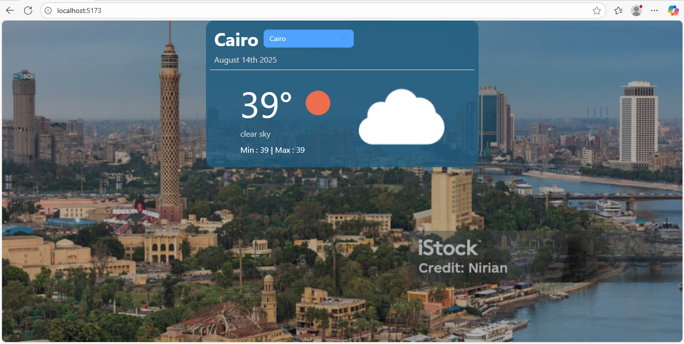

# Weather App



A simple weather app that shows the current weather for different cities around the world.

## What This App Does

- Shows the current temperature, weather description, and weather icon
- Displays minimum and maximum temperatures
- Has beautiful background images for each city
- Shows the current date
- Works with 9 major cities: Cairo, Russia, London, Paris, Berlin, Madrid, New York, Tokyo, and Sydney

## How to Use

1. Open the app in your web browser
2. The app starts with Cairo weather by default
3. Use the dropdown menu to select a different city
4. The weather information and background image will change automatically

## What Technologies This App Uses

### Core Framework & Build Tools

- **React** - The main framework for building the app
- **Vite** - A fast tool for building and running the app
- **ESLint** - Code linting and quality assurance

### State Management

- **Redux Toolkit** - For managing application state
- **React Redux** - React bindings for Redux

### Styling & UI Components

- **Tailwind CSS** - For styling and making the app look good
- **Material-UI (MUI)** - React component library for UI elements
- **Radix UI** - Low-level UI primitives for select components
- **Styled Components** - CSS-in-JS styling solution
- **Lucide React** - Beautiful & consistent icon toolkit
- **Class Variance Authority** - For creating type-safe component variants
- **Tailwind Merge** - Utility for merging Tailwind CSS classes

## How to Set Up and Run

### Step 1: Install Dependencies

Open your terminal/command prompt in the project folder and run:

```bash
npm install
```

### Step 2: Start the App

Run this command to start the app:

```bash
npm run dev
```

### Step 3: Open in Browser

The app will open automatically in your browser, usually at `http://localhost:5173`

## How to Build for Production

To create a version you can put on a website, run:

```bash
npm run build
```

## What Technologies This App Uses

- **React** - The main framework for building the app
- **Vite** - A fast tool for building and running the app
- **Tailwind CSS** - For styling and making the app look good
- **Axios** - For getting weather data from the internet
- **OpenWeatherMap API** - For weather information

## Project Structure

- `src/App.jsx` - The main app file
- `src/SelectDemo.jsx` - The city selection dropdown
- `src/imgs/` - Background images for each city
- `src/App.css` - Custom styles

## Notes

- This app uses the OpenWeatherMap API to get real weather data
- The app shows temperatures in Celsius
- Background images change based on the selected city
- The app updates weather information automatically when you change cities

## Troubleshooting

If the app doesn't work:

1. Make sure you have Node.js installed
2. Check that you ran `npm install` first
3. Make sure you have an internet connection
4. Try closing and reopening your terminal

## Support

If you have problems or questions, check that all the files are in the right places and that you followed the setup steps correctly.
